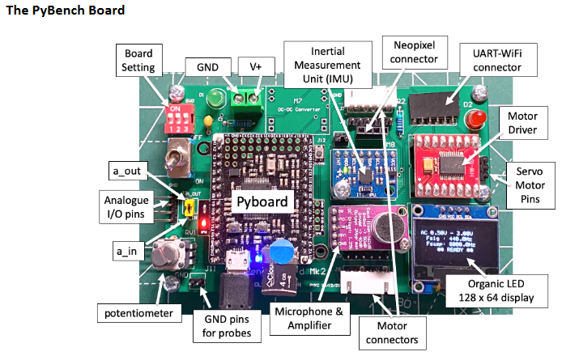

# Self-Balancing-Segway-PID

## PyBench - Segway

The PyBench was given to us 

# Challenges
This code is comprised of challenges that build up to a PID-controlled self balancing dancing segway. Each level describes the difficulty associated with each step.

## Challenge 1: Dancing LED lights (Level 1)
A Neopixel strip was attached to our PyBench and using beat detection code changed color to display its relative loudness / decibel level. Beat detection was achieved using a microphone with a moving average filter returning the instantaneous energy. The returned value was then scaled proportionately to the previously recorded noise to turn into an integer from 1 to 8 (as the neopixel strip used had 8 leds) to determine how many leds would light up.

## Challenge 2: Control speed and direction of motors using IMU (Level 2)
Using the IMU (Inertia Measurement Unit) module that read values from the board's accelormeter and gyroscope, pitch and roll angle was derived using a complementary filter due to the limitation of the individual reading of both sensors. The accelorometer is innately noisy as it cannot 'tell' the difference between acceleration due to movement or acceleration due to gravity. The gyroscope's reading of the angles contain a constant drift due to the required integeration. The complementary filter removed the noise (with a LPF) from the accelerometer value and the drift (with a HPF) from the gyroscope reading. 

To complete the challenge, pitch angle was used to control the PWM signal to the left motor and the roll angle for the right motor.

## Challenge 3: PID controller to control speed of the motors (Level 3)
This challenge required first the use of *interrupts* to measure the speed of each motor. 

This method opposed polling which is programmed response to external events (usually in a while True loop). Therefore, it may miss the event if the program is not running those code that tests of the event at the time. It is also inefficient because it runs lots of instructions just to test of event. Interrupt is more efficient because it is a ardware-forced function. It will not miss the event and it does not run any code unless the event is detected.

PID will be explained in the Self-balancing Challenge 6. But in the case of this challenge, the idea was to use PID controller to verify that the two motors are turning at identical speeds to compensate for differences in tolerances and setup. 

## Challenge 4: Segway dancing to music with stabilizers (Level 3)

This challenge focused on verifying the ability to read values from a file. Those values would then be used to move the the segway in a predetermined way. 

## Challenge 5: Self-balancing the Segway (Level 4)

The main part of this challenge was tuning the PID control effectively. In Challenge 3, although PID control was used, its shortcomings could be compensated by the PID control of the self-balancing act. 

PID (proportional integral derivative) controllers use a control loop feedback mechanism to control the actuators that impact a desired sensor output. Writing the code was simple enough once theory was understood but finding the correct values for each term was horrible. I discovered the best method was to truly understand how each value impacted the resulting feedback of the segway. This knowledge was only gained however after hours of tuning and watching tutorials. The best example I found was [this one](https://www.youtube.com/watch?v=cjSw7sc2JKk), despite it's limited description regarding the underlying mechanism. 

## Challenge 6: Self-balancing and dancing Segway (Level 4+)

This challenge was about combining every element to make the robot dance. No group in Design Engineering has managed to get this far due to the number of interrupts required for the process. 

To continue despite this limitation, we instead made the robot self balance with a neopixel strip describing the beats sensed by the microphone